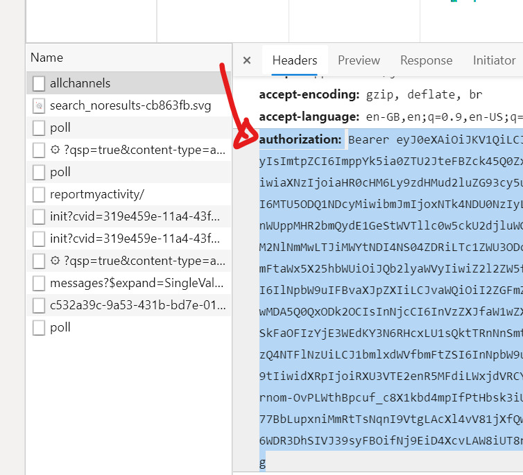

# TeamChannelAnalytics
You can use this PowerShell script to quickly export the Analytics of the last 90 days from all the channel of a given team you have access too.
Since the API doesn't expose this data, we need to simulate web request. To be able to do this, we need to first export your local Bearer to pass it as an parameter to the script.
Be aware than the bearer have the same assess as you have for up to an hour, treat it as your password.

## Get you current Bearer
* Open Edge and go to https://teams.microsoft.com 
* Press F12 to open Developper Console
* Go to Network and be sure it's running

* Click on the "..." next to a Team you are the owner and Select Manage Team

* Clear the current view

* Click on Channels

* In the Developper View, select the request named "allchannels"

* Scroll in the header to find "autorization"
* Copy all it's content including "Bearer "

